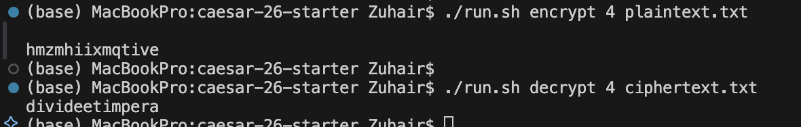

# Writeup – Caesar 26

This challenge involved implementing the **Caesar cipher**, a classic cryptographic algorithm where each letter in the plaintext is shifted a fixed number of positions in the alphabet.

---

## 🔍 My Approach

1. **Parsed CLI arguments** using `argparse` to accept:
   - Mode: `--encrypt` or `--decrypt`
   - Key: `--key n` where `n` is a positive integer
   - Input file path
2. **Validated input** to ensure it only included lowercase ASCII characters (`a`–`z`) with no special characters or whitespace.
3. **Performed Caesar shifts** using ASCII math and modular arithmetic:
   - Encryption: `chr(((ord(c) - ord('a') + key) % 26) + ord('a'))`
   - Decryption: `chr(((ord(c) - ord('a') - key) % 26) + ord('a'))`
4. **Wrote output** to `stdout`, with all debug or help output directed to `stderr` to avoid interfering with grading automation.

---

## 🧪 Sample Test

### 📄 Input File: [`plaintext.txt`](./plaintext.txt)

```
divideetimpera
```

### 🔐 Encrypted Output (key = 4)

```
hmzmhiixmqtive
```

### 🔓 Decrypted Output

```
divideetimpera
```

---

## 🖥️ Terminal Run Example

```bash
$ ./run.sh encrypt 4 plaintext.txt
hmzmhiixmqtive

$ ./run.sh decrypt 4 ciphertext.txt
divideetimpera
```

📸 _Screenshot of terminal output_  

